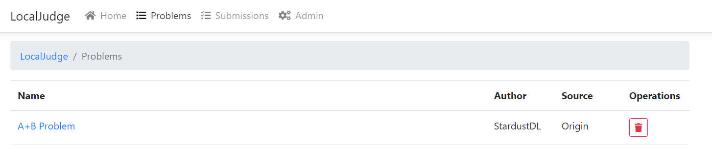
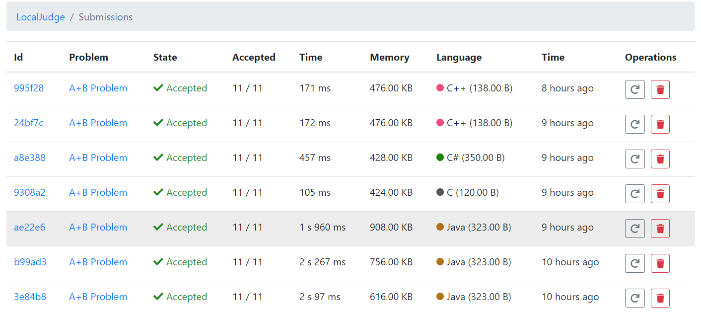
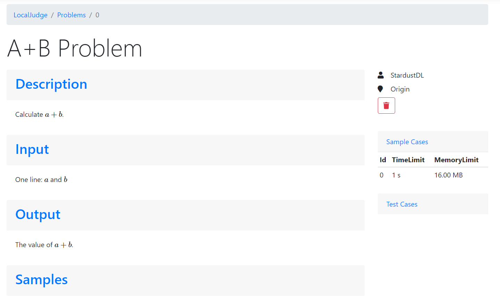
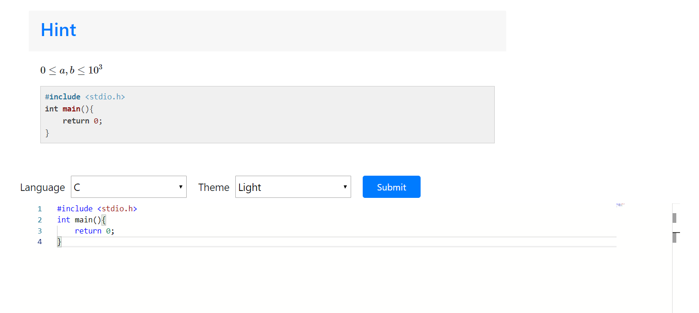
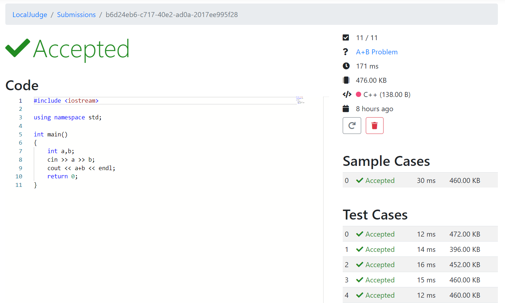

# StarOJ

StarOJ is an Online-Judge written in C#.

Now, StarOJ only supports file-system provider.

StarOJ can use local filesystem to bring an easy and friendly interface for problem judging.

- Easy to deploy
- Easy to run
- Easy to manage
- Easy to use

# Getting Started

This project contains three applications:

- `StarOJ.Server.Judger`: Judger
- `StarOJ.Server.API`: API Server, provide interface to access StarOJ's workspace.
- `StarOJ.Server.Host`: Host Server, use API Server to provide web application for users.

The judger and the API server must be in the same host, because they share the same StarOJ's workspace, and use named-pipeline to communicate.
The host server needs the URL of the API server to access the API server.

You can see the command-line options of the applications above in `server-start.ps1`.

1. Create an empty directory for StarOJ's workspace.
2. Start API server in the directory.
3. Start judger in the directory.
4. Start host server and link to the API server.
5. Open StarOJ in browser and switch to `Admin` page.
6. Click `Initialize` button.
7. Enjoy it!

To generate problems, we recommend [gop](https://github.com/StardustDL/generator-oj-problem). It has `StarOJ` in its target platform list.

# Screenshot

- Problem List

- Submission List

- Problem View

- Submission View

